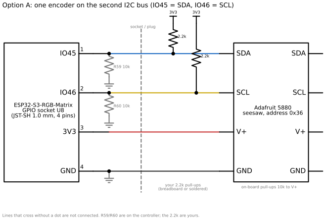
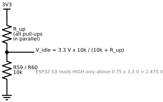
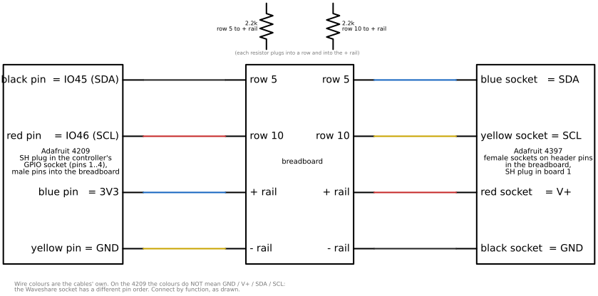
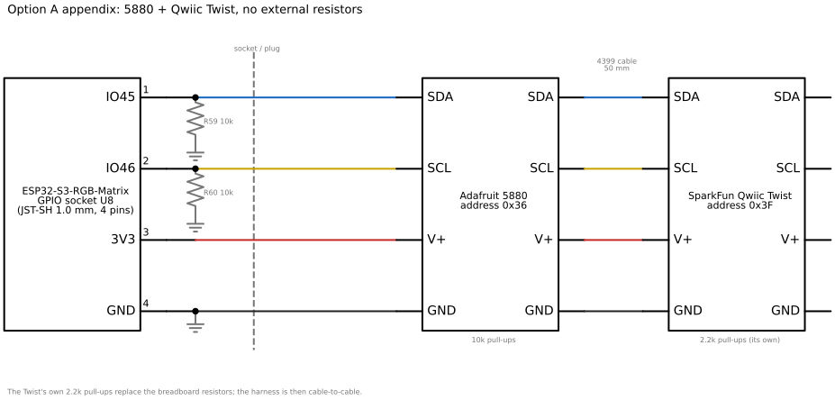

# Option A: one rotary encoder, no soldering

Written 2026-09-21, before anything was built. This is the complete project for one
Adafruit 5880 encoder on the p64, from the parts on the table to a working knob inside
the shell, without a soldering iron. Its sibling, [Option B](encoders-b-soldered.md), is
the two-encoder project with soldering. Both share the same electrical facts, the same
bench test and the same firmware plan; they differ in the number of boards, in how the
second address is set and in how the harness is made permanent.

Figures are generated by `tools/draw_encoders.py` (schemdraw) into `img/`; an ASCII
version follows each figure so the text stands on its own.

## 1. The short answer

Yes, with one encoder the project is solderless, in two steps:

- **On the bench** it is solderless without any caveat: the pull-up resistors and the
  pin-order crossing live on the ELEGOO breadboard. Sections 3 to 6.
- **Inside the shell** it stays solderless if one of three things holds, and the first
  bench measurement (section 4, step 4) tells which apply:
  1. the controller's IO45/IO46 pull-downs turn out not to be fitted: then no resistors
     are needed and the harness is just the two cables mated pin-to-socket;
  2. the resistors are needed, and a tiny breadboard (46 x 36 x 10 mm) rides inside the
     shell: this needs a shell revision (v7) with a pocket for it, because v6 has no free
     10 mm-deep flat of that size (section 7.2);
  3. the resistors are needed, and the Adafruit 5880 is swapped for a SparkFun Qwiic
     Twist, which carries its own 2.2 k pull-ups: no resistors, no breadboard, no solder,
     but a different board than the one on the table (section 7.3 and the appendix).

The soldering that the two-encoder project needs is only the address jumper on the
second board. With one board there is nothing to bridge.

Roles decided on 2026-09-21: turn = next / previous artwork, press = pause / resume.
Brightness stays on the web UI and on Makapix.

## 2. Parts

On hand (2026-09-21):

| Part | Used for |
|---|---|
| Adafruit 5880, I2C QT Rotary Encoder with encoder soldered (seesaw, address 0x36) | the knob |
| Adafruit 5528, 20 mm aluminium knob, 6 mm bore, set screw | the knob cap |
| Adafruit 4209, JST-SH 4-pin to premium male headers, 150 mm | controller socket to breadboard |
| Adafruit 4397, JST-SH 4-pin to premium female sockets, 150 mm | breadboard to encoder board |
| Adafruit 4399, JST-SH to JST-SH, 50 mm | not needed with one board (Option B uses it) |
| 2.2 kΩ resistors, 1/2 W, 5 % (40) | two pull-ups; the wattage is irrelevant here, 1/4 W would be neater |
| ELEGOO 400-point breadboards (3) | the bench junction |
| Multimeter | pin identification and the idle-level measurement |
| Jumper wires or 0.1-inch header pins | the 4397's female sockets need a pin to grip; the 5880 bag includes a short header strip |

Still needed:

| Part | For | Note |
|---|---|---|
| 2 mm hex key | the knob's set screw | not included with the knob (Adafruit) |
| Tiny breadboard, 46 x 36 x 10 mm (e.g. Adafruit 65) | in-shell path 2 only | plus double-sided foam tape |
| SparkFun Qwiic Twist (DEV-15083) | in-shell path 3 / appendix only | about $25 |
| Electrical tape or 3 mm heat-shrink | wrapping the pin-to-socket joints inside the shell | tape is fine |

## 3. The facts behind the wiring

### 3.1 The only spare connector

The ESP32-S3-RGB-Matrix brings out one spare connector: the 4-pin JST-SH 1.0 mm socket
labelled GPIO (U8 on Waveshare's schematic). Its pins, per the schematic:

| Socket pin | Signal | Our use |
|---|---|---|
| 1 | IO45 | SDA of the second I2C bus |
| 2 | IO46 | SCL of the second I2C bus |
| 3 | 3V3 | V+ of the encoder board |
| 4 | GND | GND |

The controller's internal I2C bus (IO47/IO48, with the IMU, RTC and SHTC3) is not on any
connector, so the encoder gets a bus of its own. Verify the pin order with the
multimeter before plugging anything else in (section 4, step 2).

### 3.2 STEMMA QT pin order is different

STEMMA QT / Qwiic cables are wired GND, V+, SDA, SCL (black, red, blue, yellow). The
Waveshare socket is signal, signal, 3V3, GND. A plain SH-to-SH cable between the two
would put 3.3 V on the encoder's SDA pin and ground on its V+ pin. That is why the
harness is made of the 4209 (SH plug to male pins) and the 4397 (SH plug to female
sockets), joined by function. On the 4209, plugged into the controller, the colours lie:

| 4209 wire | Lands on socket pin | Is actually |
|---|---|---|
| black | 1 | IO45 = SDA |
| red | 2 | IO46 = SCL |
| blue | 3 | 3V3 |
| yellow | 4 | GND |

Only on the 4397 (plugged into the encoder board) do the colours mean what they say.

The whole bus, as a schematic:



```
 controller GPIO socket           your 2.2k pull-ups          Adafruit 5880 (0x36)
 IO45 (R59 10k to GND) ---SDA---+----[2.2k]---3V3------------ SDA   (10k pull-up on board)
 IO46 (R60 10k to GND) ---SCL---+----[2.2k]---3V3------------ SCL   (10k pull-up on board)
 3V3 -------------------------------------------------------- V+
 GND -------------------------------------------------------- GND
```

### 3.3 The pull-downs, and why two resistors are needed

Per the schematic, IO45 and IO46 each carry a 10 k pull-down to ground on the controller
(R59, R60). The 5880 carries 10 k pull-ups to V+ on SDA and SCL. Together they form a
voltage divider: the idle level of each line is 3.3 V x 10k / (10k + R_up), where R_up
is every pull-up in parallel.



```
        3V3
         |
       [R_up]   all pull-ups in parallel
         |
         +------ V_idle = 3.3 V x 10k / (10k + R_up)
         |
       [10k]    R59 (SDA) or R60 (SCL), on the controller
         |
        GND
```

The ESP32-S3 reads a HIGH only above 0.75 x 3.3 V = 2.475 V (datasheet VIH). Cases:

| Configuration | R_up | V_idle | Result |
|---|---|---|---|
| one 5880, nothing else | 10 k | 1.65 V | fails: the bus never reads idle |
| one 5880 + 2.2 k on each line | 1.80 k | 2.80 V | ok |
| two 5880 + 2.2 k (Option B) | 1.53 k | 2.86 V | ok |
| Qwiic Twist alone (its own 2.2 k) | 2.2 k | 2.70 V | ok, small margin |
| 5880 + Qwiic Twist (appendix) | 1.80 k | 2.80 V | ok |
| pull-downs not fitted | any | 3.3 V | ok, no resistors needed |

The low level is unaffected: the seesaw pulls the line to ground through 1.5 to 1.8 k,
about 2 mA, well within what I2C allows. Nothing here is delicate; a 1.5 k or 3.3 k
resistor would also work. 2.2 k is what is on the table.

### 3.4 Strapping pins

IO45 and IO46 are ESP32-S3 strapping pins. IO45 selects the flash voltage at reset,
which the N32R16V module fixes by eFuse, so a pull-up on IO45 is harmless. IO46 high at
reset makes the ROM's manual download mode an invalid combination. Whether the USB
Serial/JTAG reset that the flash script uses still enters download mode with IO46 pulled
high is unknown and is settled on the bench (section 4, step 8). If it does not, the
rule is: pull the 4209's four header pins out of the breadboard (or the joints, in the
shell) before flashing, never the SH plug (SH connectors are rated for few mating
cycles).

### 3.5 Bus speed and cable length

150 + 150 mm of cable at 100 kHz is comfortable. The firmware starts at 100 kHz and tries
400 kHz only after everything else is verified.

## 4. Bench build

One ELEGOO breadboard. Rows are numbered along the long side, five tie points per row
per half; the two long strips on each edge are the + and - rails. Nothing is powered
until step 5.



```
 Adafruit 4209 (controller)      breadboard             Adafruit 4397 (encoder board)
 black pin  = IO45 (SDA) ------> row 5  <--[2.2k]--> + rail       row 5  ------> blue socket   = SDA
 red pin    = IO46 (SCL) ------> row 10 <--[2.2k]--> + rail       row 10 ------> yellow socket = SCL
 blue pin   = 3V3        ------> + rail                           + rail ------> red socket    = V+
 yellow pin = GND        ------> - rail                           - rail ------> black socket  = GND
```

1. **Board off.** Unplug the controller's USB and POWER.
2. **Identify the socket pins.** Plug the 4209's SH plug into the GPIO socket. Power the
   controller from USB only. Multimeter on DC volts, black probe on the USB-C shell (a
   ground). Touch each free header pin: one reads 3.3 V (expected: blue, socket pin 3);
   the two IO pins read close to 0 V (their pull-downs); the GND pin reads 0 V and beeps
   in continuity mode against the USB shell (expected: yellow). Write the four colours
   down against their function. If blue is not the 3.3 V pin, the socket's pin order
   differs from the schematic reading; use what you measured from here on. Power off.
3. **Plant the four pins.** Black (IO45) into row 5, red (IO46) into row 10, blue (3V3)
   into the + rail, yellow (GND) into the - rail. Use the outer holes of the rows so the
   inner holes stay free.
4. **Pull-ups.** One 2.2 k from row 5 to the + rail, one from row 10 to the + rail. Bend
   the leads gently; the 1/2 W leads are stiff. Nothing else on the board yet.
5. **Measure the divider.** Power on. Measure row 5 and row 10 against the - rail.
   Expected about 2.7 V (2.2 k up against 10 k down, plus the chip's weak internal
   pull-down). Two other outcomes are informative: 3.3 V means the pull-downs are not
   fitted (in-shell path 1 applies; the resistors stay, they are harmless), and about
   0 V means the pin is driven low by the firmware or the socket order is not what step
   2 concluded. Power off.
6. **Pins for the 4397.** Push a header pin (or a jumper wire) into row 5, row 10, the +
   rail and the - rail. Slide the 4397's female sockets onto them by function: blue on
   row 5, yellow on row 10, red on the + rail, black on the - rail. Plug the SH end into
   either STEMMA QT socket of the 5880.
7. **Measure again.** Power on. Row 5 and row 10 should now read about 2.8 V (the board's
   10 k pull-ups added in parallel). The board's NeoPixel stays dark; that is normal, it
   lights only on command. Record both numbers in section 5.
8. **The strapping question.** With everything connected, run `.\tools\flash.ps1` from
   `firmware/`. Pass: the encoder can stay connected for good. Fail (the tool cannot
   enter download mode): pull the four 4209 pins out of the breadboard, flash, plug them
   back in, and section 3.4's rule stands.
9. **Baseline.** Note `GET /api/v1/diag/memory` once, before the probe firmware, so the
   memory cost of the encoder task can be compared later.

## 5. Bench record

Fill in when done; the numbers decide the in-shell path and are copied into the READMEs.

| Item | Expected | Measured |
|---|---|---|
| 3V3 pin colour on the 4209 | blue | |
| GND pin colour on the 4209 | yellow | |
| Row 5 / row 10 with resistors, no board | ~2.7 V | |
| Row 5 / row 10 with the board | ~2.8 V | |
| `flash.ps1` with IO46 pulled high | works | |
| Free internal heap, largest block, before the probe | from `/diag/memory` | |

## 6. Firmware

The firmware side is the same for A and B except for the device count and the roles. It
is done in two stages, each verified on the device before the next starts, in the product
firmware itself (no separate test program: the diagnostics endpoints and smoke tests are
already there).

### 6.1 Stage B: the probe

- **Config:** `P64_ENCODERS` (bool, on), `P64_I2C_EXT_SDA` = 45, `P64_I2C_EXT_SCL` = 46,
  next to the existing I2C options in `main/Kconfig.projbuild`.
- **Bus:** `system::i2c_bus` gains a second bus on the other I2C controller (`I2C_NUM_1`)
  for those pins, created on first use like the first, internal pull-ups enabled (they
  add a weak 45 k in parallel, which helps slightly), internal pull-downs disabled. The
  IMU keeps its own bus, so the 250 Hz IMU polling and the encoder polling never contend.
- **Seesaw driver** (`p64_inputs/src/seesaw.*`): the protocol is a two-byte register
  address (module, register), a STOP, a pause of about 250 µs, then the read. That pause
  is the one thing that trips people using the new I2C driver; it belongs in the driver,
  not the callers. Registers used (from Adafruit's `Adafruit_seesaw.h`):
  - STATUS 0x00 / HW_ID 0x01: expect 0x87 (ATtiny817); the probe logs what it reads.
  - STATUS 0x00 / SWRST 0x7F: software reset at start.
  - ENCODER 0x11 / POSITION 0x30 (int32, big-endian) and DELTA 0x40.
  - GPIO 0x01: DIRCLR_BULK 0x03, PULLENSET 0x0B, BULK_SET 0x05 with mask 1 << 24 to make
    the switch (seesaw pin 24) an input with pull-up; BULK 0x04 reads it (0 = pressed).
  - NEOPIXEL 0x0E: PIN 0x01 = 6, BUF_LENGTH 0x03 = 3, BUF 0x04, SHOW 0x05.
- **Poll task** on core 0, 50 Hz, stack in PSRAM
  (`xTaskCreatePinnedToCoreWithCaps`). The seesaw counts detents itself, so no step is lost
  between polls. The task never touches flash: anything that ends in NVS is handed to
  the show loop as an event (rule from `CLAUDE.md`).
- **Visible checks:** at start the NeoPixel of 0x36 goes green for two seconds, then
  off; every detent and press logs one line; `GET /api/v1/diag/encoders` returns
  positions, press states, counters and read errors per address;
  `tests/device/encoders_smoke.py` prints positions live while the knob is turned and
  checks that the expected addresses answer.
- **Acceptance:** 200 detents each way with no miscount, presses register, no read
  errors over ten minutes with the panel busy and Makapix connected, and internal RAM
  after boot within a few hundred bytes of the bench baseline. The sign of the count
  (Adafruit's examples negate it, so clockwise may come out negative) is settled here.

### 6.2 Stage C: the roles

- Turn clockwise = next, counter-clockwise = previous (through history, as the API
  actions do); press = pause / resume. A long press is reported but unassigned.
- Plumbing: the encoder events join `inputs::Hooks` next to the tap gestures; the show
  loop handles them exactly as it handles `/api/v1/action/next`, `previous` and `pause`.
- Settings: `encoders.enabled`, `encoders.invert` (swap the turn direction).
- Docs: `firmware/docs/architecture.md`, `api.md`, `PROGRESS.md`; the wiring and the
  bench numbers into `hardware-tests/README.md` (board facts) and `enclosure/README.md`.

## 7. In-shell assembly, solderless

### 7.1 The harness

The breadboard's crossing job is done by mating the two cables directly: each male pin of
the 4209 pushes into one female socket of the 4397, paired by function. Wrap each joint
in a turn of tape (or slide 3 mm heat-shrink over the socket before mating and shrink it
with a hair dryer). No tool, no solder.


```
 4209 (controller)            4397 (encoder board)
 black pin  (IO45 = SDA) --->  blue socket   (SDA)
 red pin    (IO46 = SCL) --->  yellow socket (SCL)
 blue pin   (3V3)        --->  red socket    (V+)
 yellow pin (GND)        --->  black socket  (GND)
```

The pull-ups are the remaining question, answered by the bench measurement of section 4,
step 5:

### 7.2 Path 1 and path 2: the 5880 stays

- **Path 1, pull-downs not fitted** (row 5 read 3.3 V): mate the cables as above, plug
  the 4397 into the 5880, done. Nothing else in the shell.
- **Path 2, pull-downs present** (row 5 read about 2.7 V): the resistors need a junction
  box, and the solderless junction box is a tiny breadboard, 46 x 36 x 10 mm (Adafruit
  65 or the same SYB-170 from any supplier), stuck to the inside of the shell's back
  wall with foam tape, with the same layout as section 4 (rows 5 and 10, the two rails,
  two resistors, the 4209 pins and header pins for the 4397). Where it goes: the v6
  cavity has no free flat 10 mm deep and 46 x 36 mm in size. Measured against the v6
  source: the controller occupies x = -16..26, y = -53..-3 mm (shell coordinates, seen
  from the back) and stands 7.7 mm behind the frame face; the encoder board takes
  x = 34..60, y = -38..-12 (the right-hand position; the left mirror is free with one
  knob); above the controller the cavity is 12.9 mm deep at y = -3 and drops below 10 mm
  around y = +25. So the breadboard needs a v7 shell with a local pocket about 5 mm
  deeper over roughly x = -25..25, y = 0..40, on the back face above the controller. That
  revision also drops the unused second encoder hole. Until v7 exists, path 2 runs on the
  bench only.

### 7.3 Path 3: the Qwiic Twist instead

If the pull-downs are present and a shell pocket is not wanted, the SparkFun Qwiic Twist
(DEV-15083) replaces the 5880: it has 2.2 k pull-ups of its own (SparkFun's hookup
guide), which puts the idle level at 2.70 V, above the 2.475 V threshold with a small
margin. Then the harness is the mated cables alone, in the v6 shell as it is, except that
the Twist board is 25.4 x 30.5 mm with a different hole pattern, so the encoder posts of
v6 (made for the 5880) need redoing in v7 anyway. The knob fits: the Twist's encoder has a
6 mm shaft and the 5528 knob grips any 6 mm shaft with its set screw. The Twist's RGB LED
sits under the knob and is simply left off. The appendix has its wiring and firmware.

### 7.4 Mounting the knob

1. Firmware first: finish stages B and C on the bench, then power off.
2. From inside the shell push the board onto its four pegs with the shaft through the
   7.4 mm hole (the v6 right-hand position; the board is turned so its two STEMMA QT
   sockets face up and down, `enc_rot`).
3. From outside fit the washer and the nut on the 5880's bushing, hand-tight, at most
   10 kgf·cm. The nut takes the knob's push force; the pegs only stop the board turning.
4. Slide the knob on, black mark up, and tighten the set screw with the 2 mm hex key
   onto the flat of the D-shaft.
5. Route the harness: the GPIO socket is on the controller's right edge at about the
   encoder's height, so the 300 mm of cable is far more than the 20 mm gap; coil the
   slack flat against the back wall, away from the panel's ribbon and the USB adapters,
   and keep it off the encoder board's solder side.
6. Connect the chain before sliding the panel in, then run `encoders_smoke.py` once
   more with the shell closed.

## 8. What can go wrong

| Symptom | Likely cause | Check |
|---|---|---|
| Probe logs "no seesaw at 0x36" | SDA/SCL swapped, a socket not seated, or idle level too low | rows read ~2.8 V; swap black/red pins |
| Rows read 1.65 V with the board | a pull-up missing or in the wrong row | resistor legs in row 5 / row 10 and the + rail |
| `flash.ps1` cannot enter download mode | IO46 high at reset | pull the four 4209 pins, flash, replace (section 3.4) |
| Reads work, then errors under load | bus too fast for the cable | stay at 100 kHz |
| Device reboots when a knob is turned | the poll task touched flash (NVS) | events to the show loop only (section 6.1) |
| Count runs backwards | sign convention | `encoders.invert` |

## Appendix: two knobs without soldering (5880 + Qwiic Twist)

The two-encoder project needs soldering only because two 5880s must have different
addresses (jumper A0). A second board with a software-set address avoids it: the SparkFun
Qwiic Twist answers at 0x3F by default (0x3E with its own jumper, not needed), changeable
by register and stored in its EEPROM. The 5880 keeps 0x36. Both boards' pull-ups in
parallel (10 k and 2.2 k) give an idle level of 2.80 V, so no external resistors, no
breadboard, and the harness of section 7.1 is the whole wiring.



```
 controller GPIO ---4209 + 4397 mated---> 5880 (0x36) ---4399 50 mm---> Qwiic Twist (0x3F)
 IO45 = SDA, IO46 = SCL, 3V3, GND         10k pull-ups                  2.2k pull-ups
```

- **Parts:** one Qwiic Twist (DEV-15083, about $25); the 4399 between the boards on the
  bench, and for the shell a 200 mm SH-SH cable (Adafruit 4401), because the two knob
  positions are 94 mm apart and the sockets face up/down.
- **Bench:** section 4 without step 4's resistors, and with the Twist chained on the
  5880's free socket. Expect about 2.8 V on rows 5 and 10.
- **Firmware:** a second small driver (`p64_inputs/src/twist.*`), plain byte registers
  with an auto-incrementing pointer (SparkFun's Arduino library header): ID 0x00
  (expect 0x5C), STATUS 0x01 (bit 0 encoder moved, bit 1 button pressed, bit 2 button
  clicked; write back to clear), COUNT 0x05 (int16), DIFFERENCE 0x07 (int16), RED /
  GREEN / BLUE 0x0D..0x0F (set to 0 to keep the LED dark), CHANGE_ADDRESS 0x18, LIMIT
  0x19. The probe treats both boards alike behind one `Encoder` interface.
- **Roles** as decided on 2026-09-20 for two knobs: the 5880 is knob A (turn =
  brightness, press = pause / resume), the Twist is knob B (turn = next / previous,
  press = Makapix like), with a settings switch to swap them once the shell shows which
  is left.
- **Shell:** v7 must give the Twist its own posts (25.4 x 30.5 mm board, its hole pattern
  from SparkFun's Eagle files) at the left position; the right position keeps the 5880's.

## Sources

- Waveshare ESP32-S3-RGB-Matrix schematic (GPIO socket U8, R59/R60 10 k):
  https://github.com/waveshareteam/ESP32-S3-RGB-Matrix/tree/main/hardware/schematics
- Adafruit 5880 guide (pinout, 10 k pull-ups, jumpers, switch on seesaw pin 24, NeoPixel
  on pin 6): https://learn.adafruit.com/adafruit-i2c-qt-rotary-encoder/pinouts
- Adafruit seesaw register map: https://github.com/adafruit/Adafruit_Seesaw
- SparkFun Qwiic Twist hookup guide (2.2 k pull-ups, 0x3F, register map):
  https://learn.sparkfun.com/tutorials/qwiic-twist-hookup-guide
- Adafruit 5528 knob (6 mm bore, 2 mm hex set screw): https://www.adafruit.com/product/5528
- ESP32-S3 datasheet, VIH min 0.75 VDD; strapping pins IO45/IO46.
- Shell numbers: `enclosure/src/p64_enclosure_v6.scad` and `enclosure/README.md`.
