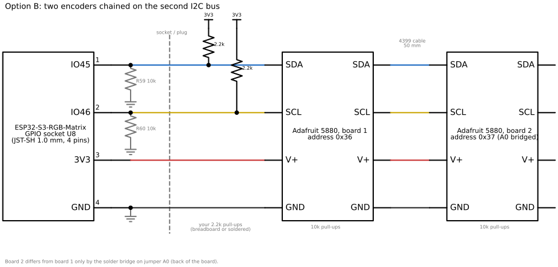
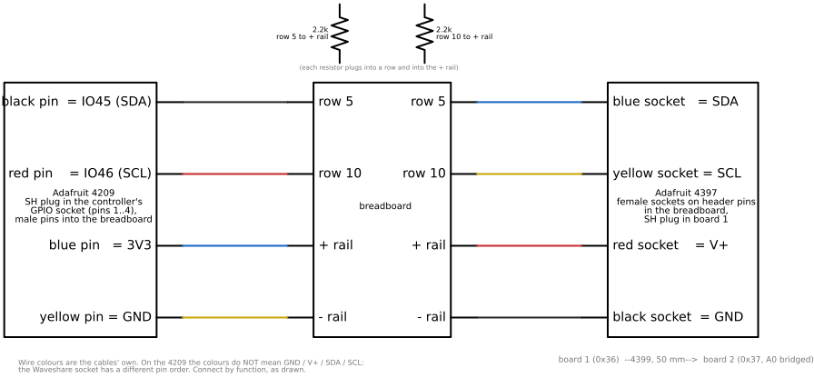

# Soldered option: two rotary encoders, with soldering

Written 2026-09-21, before anything was built. Both options belong to **p64b**, the variant with encoders; p64a has none. This is the complete project for the two
Adafruit 5880 encoders on the p64, from the parts on the table to two working knobs
inside the p64b shell (enclosure v7b). Its sibling, [the solderless option](encoders-solderless.md), is the one-encoder
project without soldering; the electrical facts (section 3 there) are the same and are
only summarised here.

Two tiers, both documented:

- **Tier 1, one solder bridge.** The only soldering that two 5880s strictly need is the
  address jumper A0 on the second board. Everything else stays on the breadboard, so the
  project can be built and the firmware finished before any further soldering.
- **Tier 2, the permanent harness.** The two pull-up resistors soldered onto board 1 and
  the two cables either mated pin-to-socket or spliced, so nothing but boards and cables
  goes into the shell.

Figures are generated by `tools/draw_encoders.py` (schemdraw) into `img/`; an ASCII
version follows each figure.

Roles decided on 2026-09-20: knob A (address 0x36) turn = brightness, press = pause /
resume; knob B (0x37) turn = next / previous, press = Makapix like; a long press is
unassigned; a settings switch swaps A and B once the shell shows which knob is left.

## 1. Parts

On hand (2026-09-21): the two 5880 boards, the two 5528 knobs, the 4209 and 4397 cables
(150 mm), the 4399 cable (50 mm), the 2.2 k resistors, the ELEGOO breadboards, a
multimeter, a soldering iron with solder, jumper wires or header pins (the 5880 bags
include a short header strip each).

Still needed:

| Part | For | Note |
|---|---|---|
| 2 mm hex key | the knobs' set screws | not included with the knobs |
| SH-SH cable, 200 mm (Adafruit 4401) | board to board inside the shell | the two knob positions are 94 mm apart and the sockets face up/down; the 50 mm 4399 is for the bench only |
| Electrical tape or 3 mm heat-shrink | wrapping the cable joints | tape is fine |
| Tier 2 only: 1/4 W 2.2 k resistors (optional) | neater on the board than 1/2 W | the 1/2 W parts work, they are just bulky |
| Tier 2 splice only: wire cutters/strippers, 2 mm heat-shrink, a lighter or heat gun | joining the cables | only if the pin-to-socket joints are not wanted |
| Soldering consumables | flux (a pen), a damp sponge or brass wool, isopropyl alcohol | flux makes the jumper bridge easy |

## 2. Electrical summary

Full reasoning and numbers in the solderless option, section 3. In one table:

| Fact | Consequence |
|---|---|
| The controller's only spare connector is the 4-pin JST-SH "GPIO" socket: pin 1 IO45, 2 IO46, 3 3V3, 4 GND (schematic) | second I2C bus, IO45 = SDA, IO46 = SCL |
| STEMMA QT order is GND, V+, SDA, SCL; the socket's is signal, signal, 3V3, GND | never a straight SH-SH cable to the controller; 4209 + 4397 joined by function |
| IO45/IO46 carry 10 k pull-downs (R59/R60); each 5880 has 10 k pull-ups | two boards alone idle at 2.20 V, below the 2.475 V threshold; with one 2.2 k per line: 2.86 V |
| IO46 high at reset breaks the manual download mode | whether USB flashing still works is tested on the bench; if not, unplug the header pins to flash |
| Two seesaw boards need different addresses | board 2 gets jumper A0 bridged: 0x37 |



```
 controller GPIO socket           your 2.2k pull-ups        board 1 (0x36)      board 2 (0x37, A0 bridged)
 IO45 (R59 10k to GND) ---SDA---+----[2.2k]---3V3----------- SDA ---- SDA ---4399--- SDA
 IO46 (R60 10k to GND) ---SCL---+----[2.2k]---3V3----------- SCL ---- SCL ---4399--- SCL
 3V3 -------------------------------------------------------- V+  ---- V+  ---4399--- V+
 GND -------------------------------------------------------- GND ---- GND ---4399--- GND
```

## 3. Soldering, tier 1: the A0 bridge on board 2

This is the smallest soldering job there is: joining two pads that are 0.3 mm apart with
one blob of solder. Do it before the bench build, on the board that will be knob B.

### 3.1 Setup

- Iron at 320 to 350 °C (leaded 63/37 solder) or 350 to 380 °C (lead-free). A fine
  conical or small chisel tip. Ventilate; do not breathe the smoke; wash hands after
  leaded solder.
- Tin the tip: melt a little solder onto it, wipe on the damp sponge or brass wool; the
  tip should be shiny.
- Board on the bench, back side up, held down with a bit of tape or in a helping-hands
  clip. Find the three jumpers labelled A0, A1, A2 (Adafruit's pinout page); each is a
  pair of small pads with a narrow gap. Only A0 is touched.

### 3.2 The bridge

1. Dab flux on the A0 pads (optional but makes step 3 a one-touch job).
2. Put a small bead of solder on the tip.
3. Touch the tip flat across both pads for one to two seconds. The solder flows onto
   both pads and fills the gap. Lift the iron straight up.
4. Look at it under good light: a smooth, shiny bridge spanning both pads, not a ball
   sitting on one pad, and nothing touching the neighbouring A1 pads or any trace.
5. If it bridged only one pad, add flux and touch again. If it bridged A0 and A1
   together, drag the iron tip across the excess to pull it away, or add flux and wipe
   the tip along the gap; the surplus follows the tip.
6. Clean the flux with isopropyl alcohol on a cotton swab.

### 3.3 Checks

- Multimeter in continuity mode across the two A0 pads: beep.
- Continuity between the A0 pads and the neighbouring A1 pads: no beep.
- The real test is the probe firmware (section 6): the board must answer at 0x37, and
  the NeoPixel colour tells which board is which.
- Mark the board (a dot of paint or tape on the edge) as "B / 0x37".

## 4. Bench build

Same as the solderless option, section 4, with the second board chained. Nothing is powered until
step 5.



```
 Adafruit 4209 (controller)      breadboard             Adafruit 4397 (board 1)         4399 (board 1 to board 2)
 black pin  = IO45 (SDA) ------> row 5  <--[2.2k]--> + rail   row 5  ------> blue socket   = SDA   board 1 0x36 --50 mm--> board 2 0x37
 red pin    = IO46 (SCL) ------> row 10 <--[2.2k]--> + rail   row 10 ------> yellow socket = SCL
 blue pin   = 3V3        ------> + rail                       + rail ------> red socket    = V+
 yellow pin = GND        ------> - rail                       - rail ------> black socket  = GND
```

1. Board off (USB and POWER unplugged).
2. Identify the socket pins with the 4209 plugged in and the controller on USB: the pin
   at 3.3 V (expected blue), the pin with continuity to the USB-C shell (expected
   yellow), the two IO pins near 0 V (black = IO45, red = IO46). Record the colours.
   Power off.
3. Plant the four pins: black in row 5, red in row 10, blue in the + rail, yellow in the
   - rail.
4. One 2.2 k from row 5 to the + rail, one from row 10 to the + rail.
5. Power on, measure rows 5 and 10 against the - rail: about 2.7 V expected (3.3 V would
   mean the pull-downs are not fitted; the resistors stay either way). Power off.
6. Header pins into rows 5 and 10 and the two rails; the 4397's sockets onto them by
   function (blue row 5, yellow row 10, red +, black -); its SH plug into board 1 (the
   unmodified 0x36 board).
7. The 4399 from board 1's free socket to board 2 (A0 bridged).
8. Power on, measure again: about 2.86 V (two boards' pull-ups in parallel with the
   2.2 k). Record.
9. `.\tools\flash.ps1` from `firmware/` with everything connected: the IO46 question.
   Pass: the chain stays connected for good. Fail: pull the four 4209 pins to flash.
10. Note `GET /api/v1/diag/memory` once as the baseline.

Bench record:

| Item | Expected | Measured |
|---|---|---|
| 3V3 / GND pin colours on the 4209 | blue / yellow | |
| Rows 5 and 10, resistors only | ~2.7 V | |
| Rows 5 and 10, both boards | ~2.86 V | |
| A0 continuity on board 2 | beep | |
| `flash.ps1` with IO46 pulled high | works | |
| Free internal heap, largest block, before the probe | from `/diag/memory` | |

## 5. Firmware

Identical to the solderless option, section 6, with two devices. Only the differences:

- **Probe (stage B):** the driver opens both addresses; at start the NeoPixel of 0x36 goes
  green and that of 0x37 blue for two seconds, so the boards identify themselves;
  `GET /api/v1/diag/encoders` and `tests/device/encoders_smoke.py` report both. A board
  that does not answer is logged once and polled again every 5 s (a loose cable must not
  take the other knob down).
- **Roles (stage C):** knob A = 0x36: turn = brightness in the spec's curve steps (through
  the settings path, which wraps NVS on an internal stack; the poll task itself never
  touches flash), press = pause / resume. Knob B = 0x37: turn = next / previous, press =
  like the current Makapix artwork (no-op on card artworks; the like call blocks up to
  20 s, so it is queued to the Makapix task, never run from the show loop). Settings:
  `encoders.enabled`, `encoders.swap` (A and B exchange roles), `encoders.invert`.
- **Acceptance:** as in A, on both knobs, plus: turning both at once loses no detents;
  unplugging the 4399 while running logs the loss and does not disturb knob A.

## 6. Soldering, tier 2: the permanent harness

Do this after the firmware is accepted on the bench: the breadboard is then the last
thing between the bench and the shell.

### 6.1 The pull-ups on board 1

The 5880 has a row of plated header pads along one edge: VIN, 3Vo, GND, SCL, SDA, INT
(names from Adafruit's pinout page; the silkscreen shows the order). The pull-ups must
go to VIN, which is the 3.3 V the controller supplies and the level the board's own
pull-ups use.

1. Bend each resistor's leads down so it can stand on the board's back (the side
   without the encoder), one lead in the VIN hole, the other in the SDA hole for the
   first resistor and in the SCL hole for the second. Two leads share the VIN hole:
   push one through from each side, or twist the two lead ends together first. With the
   1/2 W bodies this is bulky; 1/4 W resistors lie flat between the holes.
2. Solder each lead in its hole from the component-free side: touch pad and lead with
   the tip, feed solder for one second, lift. A good joint is a shiny cone wetting both
   the pad and the lead.
3. Cut the leads flush with side cutters.
4. Check: continuity between the SDA pad and VIN reads about 2.2 k on the ohms range
   (the 10 k on the board in parallel shows about 1.8 k); the same for SCL. No
   continuity between SDA and SCL, or between VIN and GND.

Board 2 gets no resistors: one pair per bus.

### 6.2 The cables

Two acceptable ways; the first needs no soldering at all and is what the author
recommends for a first project.

**Mated (no solder).** Each male pin of the 4209 pushes into one female socket of the
4397, paired by function, each joint wrapped in tape or heat-shrink:


```
 4209 (controller)            4397 (board 1)
 black pin  (IO45 = SDA) --->  blue socket   (SDA)
 red pin    (IO46 = SCL) --->  yellow socket (SCL)
 blue pin   (3V3)        --->  red socket    (V+)
 yellow pin (GND)        --->  black socket  (GND)
```

**Spliced (solder).** Cut the header end off the 4209 and the socket end off the 4397,
leaving the lengths the shell needs (about 60 mm each is plenty: the GPIO socket is
20 mm from the right-hand board). Strip 5 mm of each wire, slide a 20 mm piece of 2 mm
heat-shrink onto one side, twist the pairs by function (black-4209 to blue-4397,
red to yellow, blue to red, yellow to black), tin each twist with the iron, slide the
heat-shrink over it and shrink. Then a larger piece over all four. Do one pair at a
time; the colours cross, so label the 4209 side first.

### 6.3 Between the boards

The 200 mm 4401 (or a 100 mm 4210, tight) from board 1's free socket to board 2. The
sockets face up and down in the shell, so the cable runs down from the right board, along
the bottom of the cavity, above the two USB-C adapters and the cradle insert, and up into
the left board.

## 7. In-shell assembly

The p64b shell (enclosure v7b, `enclosure/output/p64b/v7b/`) has both encoder positions:
shafts at (±47, -25) mm on the back face, i.e. 19 mm in from each side edge and 41 mm up
from the bottom edge. Each position has four posts from the inside of the back wall, each
ending in a 2.2 mm peg for one of the board's 2.5 mm holes, a 7.4 mm hole for the bushing
and, outside, a 14 mm spot-face 0.4 mm deep that gives the washer and nut a flat seat on
the sloping wall (`enclosure/README.md`, "Encoders (p64b only)", and
`enclosure/src/p64_enclosure_v7.scad`). The pegs only key the board so it cannot turn; the
washer and nut clamp it and take the knob's push. The boards go in before the panel, which
closes the shell's open front.

1. Firmware accepted on the bench, tier 2 done, power off.
2. First time only, on the fresh print: lay the washer and nut in a spot-face. Their outer
   diameter and the nut across its corners have not been measured
   (`enclosure/input/measurements.md`); an M7 set is about 11 to 12 mm, the seat is 14.
3. Plug the 4397 (or the spliced harness) into board 1 and the 4401 between the boards
   before mounting: once mounted the STEMMA QT sockets face up and down, 4.5 mm from the
   side wall, and are hard to reach.
4. Board 1 (0x36, with the resistors) goes to the right-hand position (seen from the
   back), nearest the controller's GPIO socket; board 2 to the left. Turn each board with
   its two sockets up and down and the header pads towards the centre of the shell; that
   is the only orientation the shell leaves room for. If the shell shows the roles should
   be the other way round, `encoders.swap` fixes it without rewiring.
5. From inside, push each board onto its four pegs with the shaft through the 7.4 mm
   hole, until the bushing base sits flat on the inner wall. A tight peg (elephant foot)
   gets a light trim, not force.
6. From outside, washer and nut on the bushing, hand-tight, at most 10 kgf·cm. With the
   shell on its side, a finger inside holds the board while the nut starts. The 6.0 mm
   bushing leaves 4.0 mm of thread for the 2.5 mm washer and nut.
7. Knobs on, black mark up, set screw onto the flat of the D-shaft with the 2 mm hex
   key.
8. Route the harness from the controller's GPIO socket (on the controller's right edge
   at about the encoders' height) to board 1; coil the slack flat against the back wall,
   away from the controller's power leads and the two USB-C adapters; the board-to-board
   cable along the bottom (section 6.3).
9. Connect the chain to the GPIO socket while the panel is still outside the shell, then
   slide the panel in (controller at the bottom) and fit the six M3 x 10 screws, as in
   `enclosure/README.md`, "Assembly". The pin stubs under each board reach 3.0 mm into
   the 4.1 mm left to the panel frame, so the panel seats clear of them.
10. Run `encoders_smoke.py` again with the shell closed, both knobs.

To take a board out: panel out, knob off, nut and washer off, then the board lifts off
its pegs.

The knobs are the deepest point of the shell, 13 mm past its bottom edge: the display
stands as p64a does, but laid on its back it rests on the knobs.

## 8. What can go wrong

| Symptom | Likely cause | Check |
|---|---|---|
| Both boards answer at 0x36 (probe says "0x37 missing") | A0 bridge not conducting | continuity across the A0 pads |
| A board answers at 0x38 or 0x3A | the wrong jumper was bridged (A1 = 0x38, A2 = 0x3A) | fine, the firmware can take the address as a setting; or fix the bridge |
| Rows read 2.2 V with both boards | a pull-up missing or in the wrong row | resistor legs in rows 5 / 10 and the + rail |
| Knob B works, knob A does not, or vice versa | the 4399 / 4401 not seated | reseat; the probe re-polls a missing board every 5 s |
| `flash.ps1` cannot enter download mode | IO46 high at reset | pull the four 4209 pins (or open the joints), flash, replace |
| Solder bridge across A0 and A1 | too much solder | flux and drag the tip to pull the excess |
| Device reboots when a knob is turned | the poll task touched flash (NVS) | brightness through the settings path from the show loop only |
| Count runs backwards | sign convention | `encoders.invert` |

## Sources

- Waveshare ESP32-S3-RGB-Matrix schematic (GPIO socket U8, R59/R60 10 k):
  https://github.com/waveshareteam/ESP32-S3-RGB-Matrix/tree/main/hardware/schematics
- Adafruit 5880 guide (pinout, 10 k pull-ups, jumpers A0/A1/A2 = 0x37/0x38/0x3A):
  https://learn.adafruit.com/adafruit-i2c-qt-rotary-encoder/pinouts
- Adafruit seesaw register map: https://github.com/adafruit/Adafruit_Seesaw
- Adafruit 5528 knob (6 mm bore, 2 mm hex set screw): https://www.adafruit.com/product/5528
- ESP32-S3 datasheet, VIH min 0.75 VDD; strapping pins IO45/IO46.
- Shell: `enclosure/README.md` ("Encoders (p64b only)" and "Assembly") and
  `enclosure/src/p64_enclosure_v7.scad`, rendered as `src/p64_enclosure_v7b.scad`.
